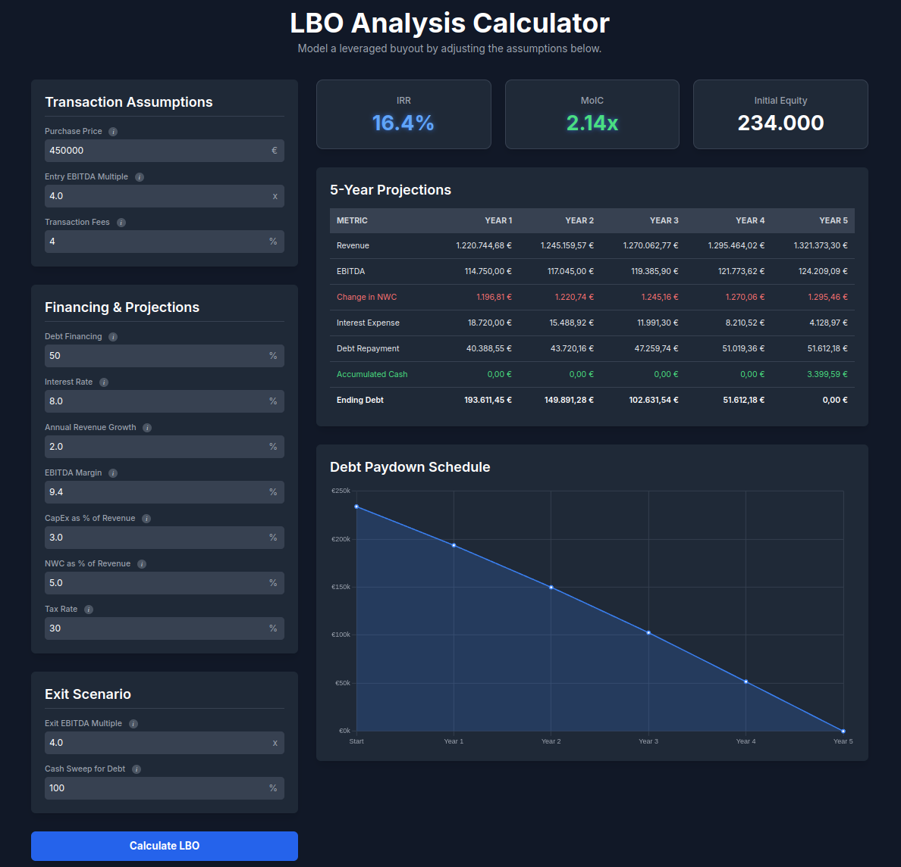

# LBO-Analysis-Calculator-
Simplified LBO analysis for quick checks

> **⚠️ WARNING: AI-Generated Code - Not Vetted by a Human**
>
> This entire project, including the financial logic, UI, and functionality, was generated by an AI. It has **not** been reviewed, tested, or validated by a human financial expert or software engineer.
>
> **DO NOT USE FOR ACTUAL FINANCIAL DECISION-MAKING.** The calculations may contain significant errors. This repository serves only as a demonstration of AI capabilities.

## Overview

A simple, interactive, single-page web application for modeling a hypothetical Leveraged Buyout (LBO). All logic is self-contained in `index.html`.

## Features

* Calculate key return metrics: **IRR** (Internal Rate of Return) and **MoIC** (Multiple on Invested Capital).
* Adjustable inputs for transaction, financing, and operational assumptions.
* Generates a 5-year projection table for key financial line items.
* Visualizes the debt paydown schedule with a dynamic line chart.

## How to Run

No build step or dependencies required.

1.  Clone the repository or download the `index.html` file.
2.  Open `index.html` directly in any modern web browser.

## Limitations

This is a high-level, educational model with significant simplifications:

* **Financial Logic:** The model omits key real-world complexities such as depreciation, detailed cash flow waterfalls, different debt tranches (e.g., senior/mezzanine), floating interest rates, and management fees.
* **Static Projections:** It assumes constant growth rates and margins over the entire holding period, which is not reflective of dynamic business environments.
* **No Input Validation:** The tool lacks robust error handling for non-numeric or illogical user inputs.
* **No Data Persistence:** All inputs are reset upon page reload.
